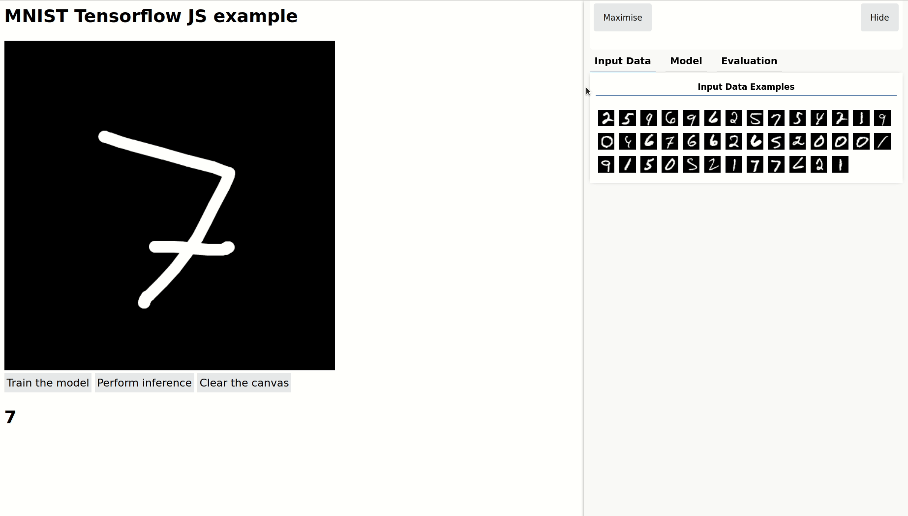

# A simple deep learning web app 

<div align="center">


[](https://github.com/ellerbrock/open-source-badges/)


</div>

## Description of the project

The goal of this simple web app is to get started and learn the basics of the library tensorflow.js

<div align="center">

[Official TensorFlowJS page](https://www.tensorflow.org/js) • [Official TensorFlowJS repo](https://github.com/tensorflow/tfjs)

</div>

## How to run the code

Run the application

``` bash
python -m http.server 8000
```

## Live demonstration



## Check if the GPU is enable on google chrome

Write the following link in the browser chrome://gpu 
You get a report with the current state of your machine.


